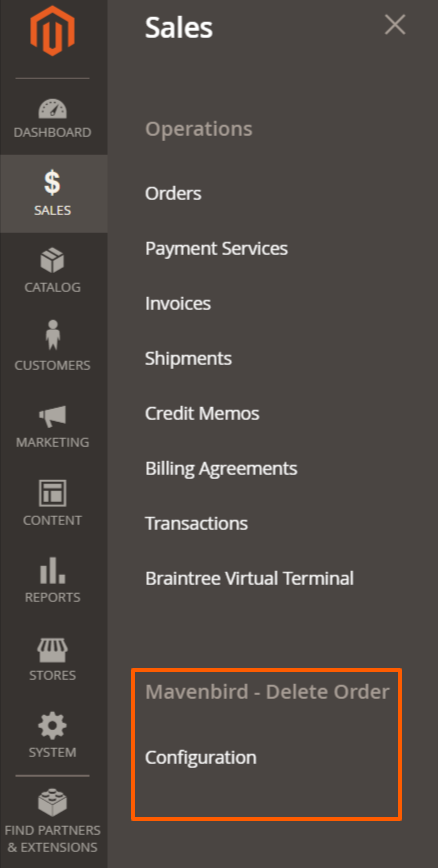
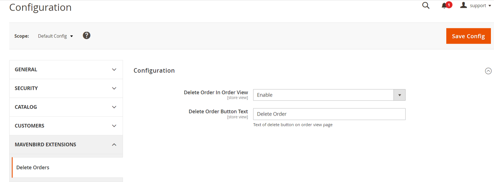
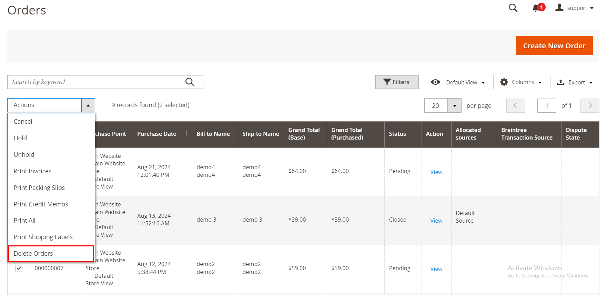
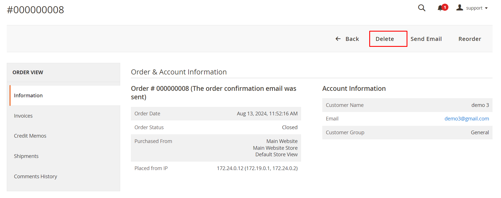
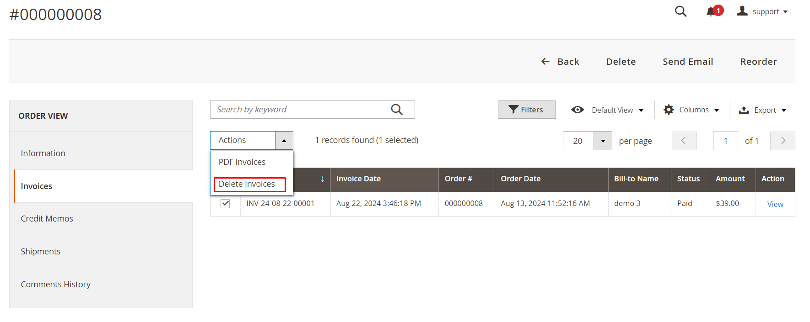
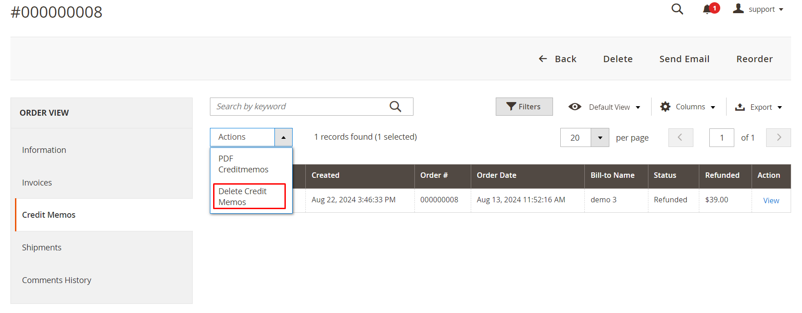
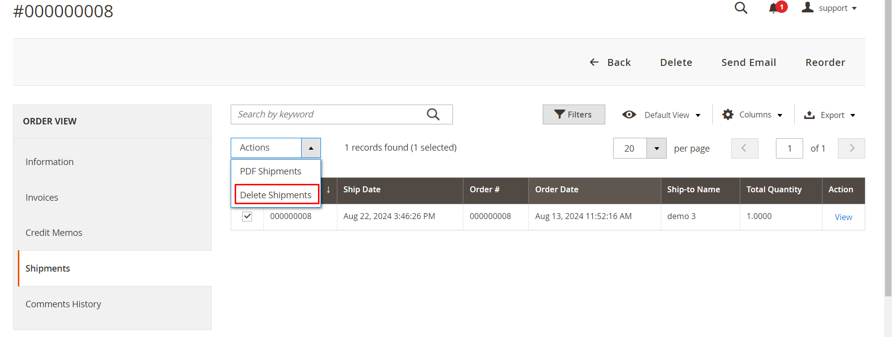

# Magento 2 Delete Order Extension

Simplify your Magento 2 store management with the ability to easily delete orders. Our Magento 2 Delete Order Extension enhances the efficiency of managing order data, allowing you to remove unwanted orders quickly and effortlessly.

## Key Features:

- **Delete Orders:**
Easily delete single or multiple orders directly from the admin panel.
- **Batch Processing:**
Support for batch deletion of multiple orders at once.
- **Confirmation Prompts:**
Ensure accuracy with confirmation prompts before deletion.
- **Detailed Logs:**
Keep track of deleted orders with comprehensive logs for auditing purposes.
- **User Permissions:**
Control access to delete order functionality with customizable user permissions.
- **Delete Invoices:**
Delete selected invoices from the backend directly via the admin panel, streamlining invoice management.
- **Delete Shipments:**
Remove unwanted shipments from the backend, helping you keep shipment data clean.
- **Delete Credit Memos:**
Easily manage and delete unwanted credit memos directly from the backend.

## Benefits:

- **Efficient Order Management:**
Streamline the process of managing orders, saving time and reducing manual effort.
- **Clean Order Data:**
Maintain clean order data by removing unwanted or test orders.
- **Secure Operations:**
Minimize errors with confirmation prompts and detailed logs.
- **Customizable Permissions:**
Ensure only authorized users can delete orders with customizable permissions.
- **Improved Invoice Management:**
Keep your invoice records organized by removing irrelevant or erroneous invoices.
- **Simplified Shipment Data:**
Eliminate unnecessary shipments, ensuring your data remains accurate and up to date.
- **Optimized Credit Memo Handling:**
Quickly clean up credit memo data, helping you maintain an accurate order history.

## Compatibility:
This extension is compatible with Magento 2.4.X (PHP - 8.1 - 8.3) version.

## Installation:
*Install via composer (recommend)* - 

Easy installation process with step-by-step instructions provided for hassle-free setup.
~~~~~~~~~~~~~~~~~~~~~
composer require mavenbird/module-delete-order
php bin/magento setup:upgrade
php bin/magento setup:static-content:deploy
php bin/magento setup:di:compile
php bin/magento cache:flush
~~~~~~~~~~~~~~~~~~~~~

## Upgrade/Update Module:
Run the following command in Magento 2 root folder for easy update -
~~~~~~~~~~~~~~~~~~~~~
composer update mavenbird/module-delete-order
php bin/magento setup:upgrade
php bin/magento setup:static-content:deploy
php bin/magento setup:di:compile
php bin/magento cache:flush
~~~~~~~~~~~~~~~~~~~~~

## Customization Options:
Tailor the delete order process to match your store's specific requirements with customizable permissions and logging options.

## Support:
Dedicated support team available to assist with installation, customization, and any other queries or concerns.
*[support@mavenbird.com](mailto:support@mavenbird.com)* 

## Get Started:
Simplify the management of your order data with our Magento 2 Delete Order Extension. Enhance efficiency, ensure data cleanliness, and streamline your workflows today!

*Thank you!*
